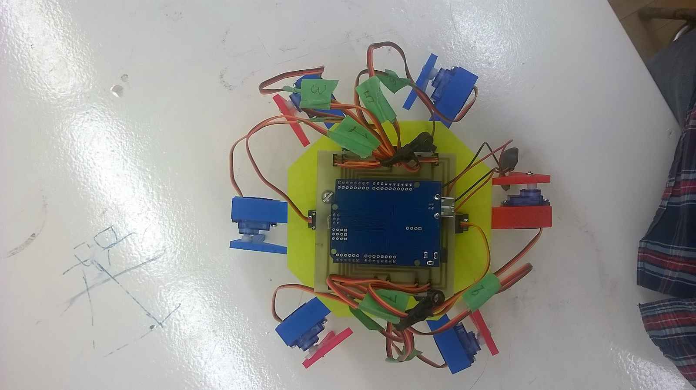
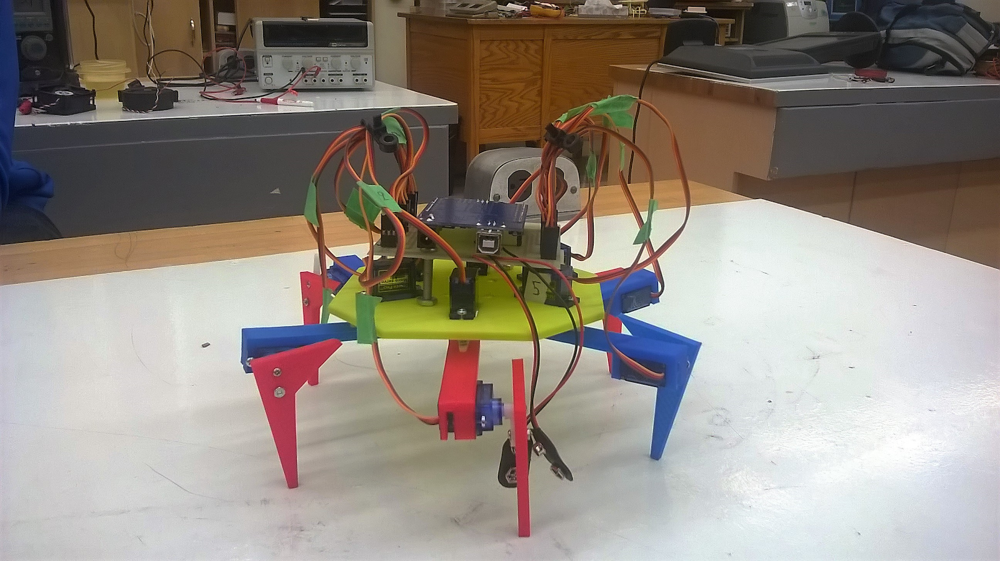

# Hexapod-Walker

This was my grade 11 Computer Engineering project

This is a hexapod-walker: a 6-legged autonomous walking robot.

The hexapod walker was created using 12 servos, and arduino, and two 9-volt batteries.  
The body and legs of the robot were designed using AutoCAD online 3D modelling and were printed.

Each leg of the robot consisted of two servos, one moving the entire leg parallel with the ground. The second servo controlled the vertical movement of the *fibula* (ie acted as the **knee** of the leg).  
When combining movement of all legs, a **_tripod_** gait was implemented.

Any additional information about the hexapod walker can be found in the [report](https://github.com/wshahbaz/Hexapod-Walker/blob/master/Hexapod%20Walker%20Report.pdf)
